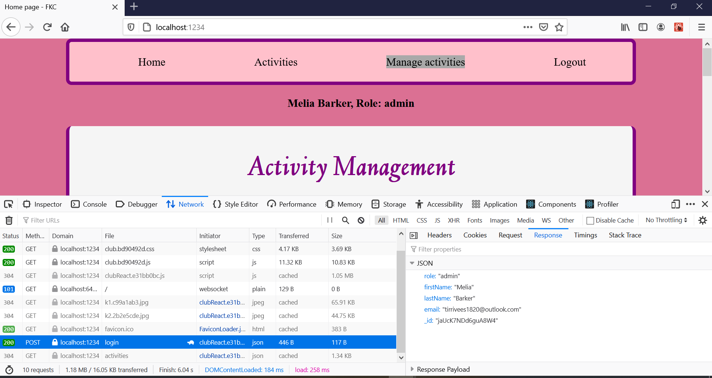
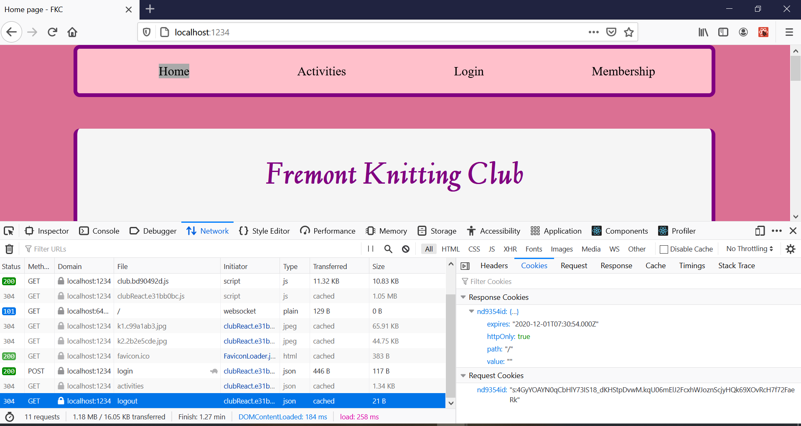
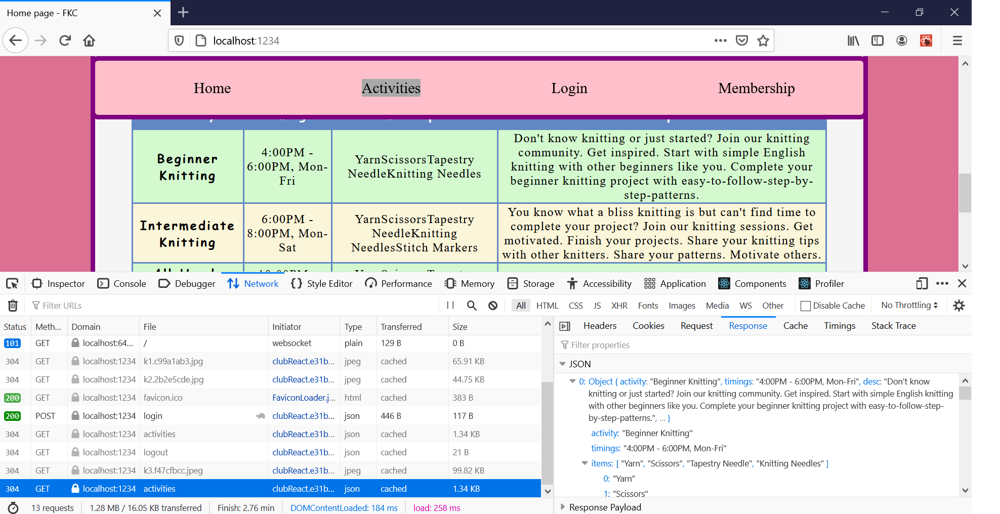
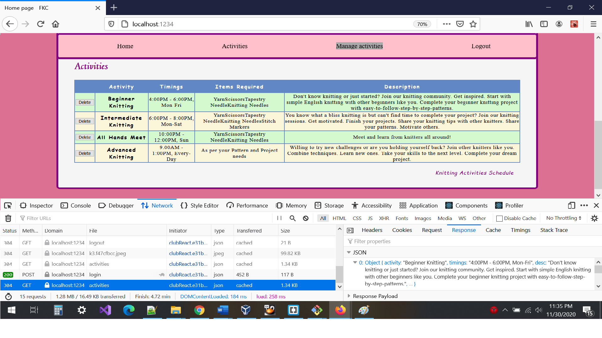
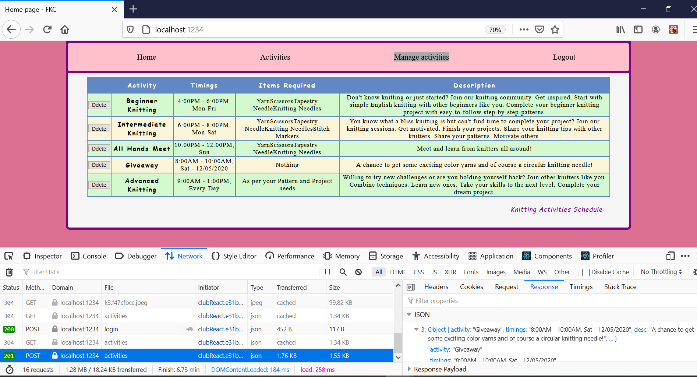
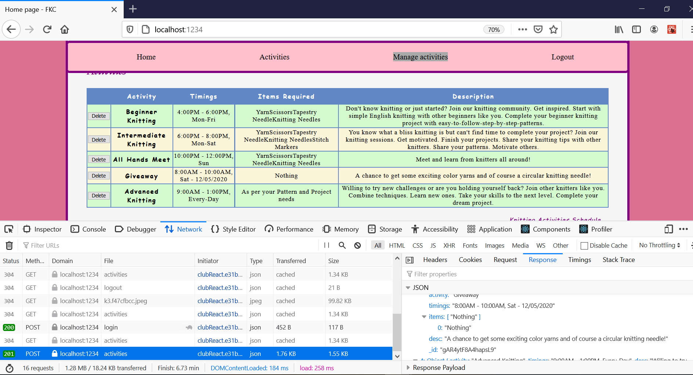

**Student Name**: Batul Zamin

**NetID**: nd9354

# Homework #12 Solutions

## Question 1: Fetch for Login

### 1(a) Member and Admin Login

```Javascript
postIt() {
    let that = this;
    fetch('./login', {
        method: 'POST',
        headers: {
            "Content-type": "application/json"
        },
        body: JSON.stringify({
            email: that.state.email, 
            password: that.state.password
        })
    })
    .then(function(response) {
        console.log('Request status code: ', response.statusText, response.status, response.type);
        if (response.ok) {
            return response.json(); // a promise
        } 
        else {
            let info = `Status code: ${response.status}, ${response.statusText}`;
            console.log(response);
            return Promise.reject(info); //rejected promise!
        }
    })
    .then(function(data) {
        that.props.onRoleChange(data.role, data);
        console.log(data);
    })
    .catch(function (info) {
        console.log(info);
        that.props.onRoleChange("guest", null);
    });
}

render() {
    let that = this;
    return <main>
    <header>
        <h1>Login</h1>
    </header>
    <form>
        <div>
            <label>Email: </label>
            <input type="email" minLength="3" maxLength="64" required="required" onChange={this.emailInputChange.bind(this)} />
            <label>Password: </label>
            <input type="password" minLength="8" maxLength="26" required="required" onChange={this.passwordInputChange.bind(this)} />
            <button id="loginButton" type="button" onClick={that.postIt.bind(that)}>Login</button>
        </div>
    </form>
</main>;
}
```

 
<p align="center">
  <i>Result of login</i>
</p>

### 1(b) Member and Admin Logout

 
<p align="center">
  <i>Logout Calls</i>
</p>

## Question 2: Fetch for Activities

### 2(a) Members Activities Component


### 2(b) Fetch Activities in the Component

```Javascript
import React from "react";
import ventures_and_knitting from "./images/k3.jpeg";

let k3 = ;

class Activities extends React.Component{
    constructor(props) {
        super(props); // Must call
        // a member variable called "state" to hold the state as a JS object
        this.state = {activities: []};
    }
    
    componentDidMount() {
        let that = this;
        fetch('./activities')
            .then(function(response){
                console.log("Request Status Code: ", response.statusText, response.status, response.type);
                if(response.ok){
                    return response.json(); // a promise
                }
                else{
                    let info = `Status code: ${response.status}, ${response.statusText}`;
                    console.log(response);
                    return Promise.reject(info);
                }
            })
            .then(function (activities) {
                that.setState({ activities: activities });
                console.log(activities);
              })
            .catch(function(msg){
                console.log("Something bad happened: " + msg);
            })
    }
    
    render(){
        let activityList = this.state.activities.map(function(comp, i){
        return <tr key={comp.activity}>
            <th scope="row">{comp.activity}</th>
            <td>{comp.timings}</td>
            <td>{comp.items}</td>
            <td>{comp.desc}</td>
        </tr>;
    });
    return <main>
        <header>
            <h1>FKC Activities</h1>
        </header>
        <figure className="figStyle3">
                {k3}
                <figcaption>Figure 1. Knitting Ventures.</figcaption>
        </figure>
        <section>
            <h2>Knitting Activities:</h2>
            <ul>
                <li>Advanced knitting sessions with Continental and English knitting</li>
                <li>Intermediate knitting sessions - Continental and English styles</li>
                <li>Beginner knitting sessions - English style</li>
            </ul>
        </section>
        <section className="tableSection">
            <h2>Activity Schedule:</h2>
            <table>
                <caption>Knitting Activities Schedule</caption>
                <thead>
                    <tr>
                        <th scope="col">Activity</th>
                        <th scope="col">Timings</th>
                        <th scope="col">Items Required</th>
                        <th scope="col">Description</th>
                    </tr>
                </thead>
                <tbody id="activityTableBody">
                    {activityList}
                </tbody>
                <tfoot>
                    <tr>
                        <td colSpan="4"><em>NOTE: Make sure you bring knitting needles with appropriate size for your yarn!</em></td>
                    </tr>
                </tfoot>
            </table>
        </section>
        </main>;
    }
}

export default Activities;
```

 
<p align="center">
  <i>Fetching Activities</i>
</p>


## Question 3: Add Activity

### 3(a) Update React App to POST Activity

```Javascript
addActivity() {
    let that = this;
    fetch('./activities', {
        method: "post",
        body: JSON.stringify({
            activity: that.state.activity, timings: that.state.timings, items: [that.state.items], desc: that.state.desc
        }),
        headers: {
            "Content-Type": "application/json"
        },
    })
    .then(function(response){
        console.log("Request Status Code: ", response.statusText, response.status, response.type);
        if(response.ok){
            return response.json(); // a promise
        }
        else{
            let info = `Status code: ${response.status}, ${response.statusText}`;
            console.log(response);
            return Promise.reject(info);
        }
    })
    .then(function (activities) {
        that.setState({ activities: activities });
        console.log(activities);
      })
    .catch(function(msg){
        console.log("Something bad happened: " + msg);
    })
}
```

### 3(b) Before and After Screenshots

 
<p align="center">
  <i>Before activity add</i>
</p>

 
<p align="center">
  <i>After activity add</i>
</p>


## Question 4: Delete Activity


### 4(a) Update React App to DELETE an Activity
```Javascript 
delActivity(i) {
    console.log(`Id to delete ${this.state.activities[i]._id}`);
    let that = this;
    fetch(`./activities/${this.state.activities[i]._id}`, {
      method: "delete",
    })
    .then(function(response){
        console.log("Request Status Code: ", response.statusText, response.status, response.type);
        if(response.ok){
            return response.json(); // a promise
        }
        else{
            let info = `Status code: ${response.status}, ${response.statusText}`;
            console.log(response);
            return Promise.reject(info);
        }
    })
    .then(function (activities) {
        that.setState({ activities: activities });
        console.log(activities);
      })
    .catch(function(msg){
        console.log("Something bad happened: " + msg);
    })
}
```

### 4(b) Before and After Screenshots

 
<p align="center">
  <i>Before activity deletion</i>
</p>

 
<p align="center">
  <i>After activity deletion</i>
</p>

## Question 5: Clean Up and Deployment


### 5(a) Clean up

### 5(b) App and Server Deployment
[My Homework 12 Deployed Website](https://www.drbsclasses.org/student47/node/)
